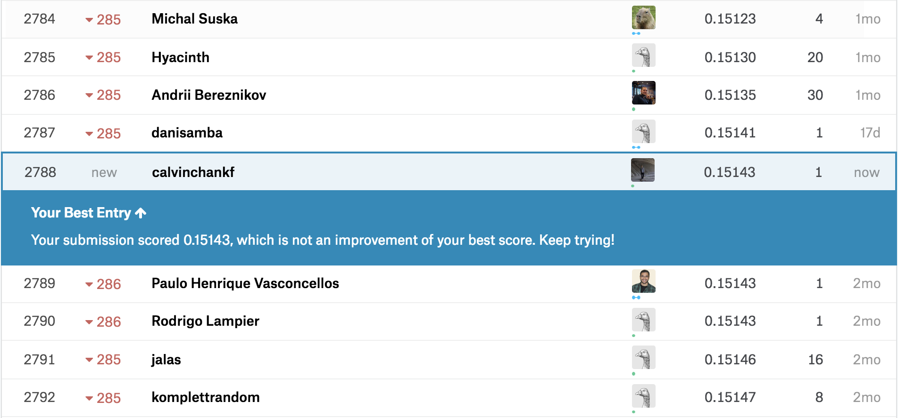
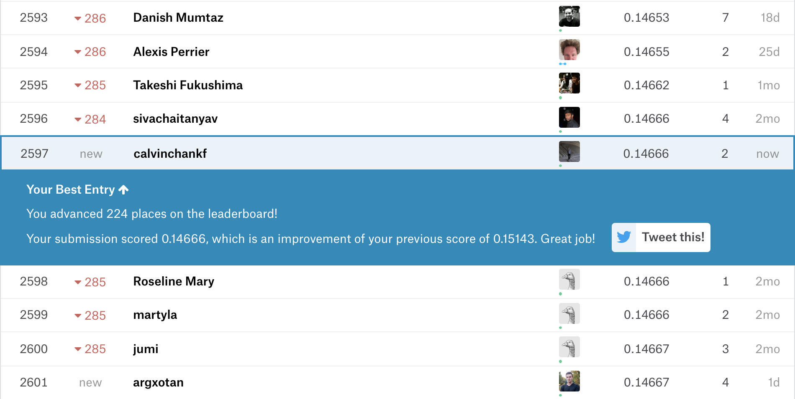

# My Hello World to Kaggle
House Prices: Advanced Regression Techniques

https://www.kaggle.com/c/house-prices-advanced-regression-techniques

# Approaches
### 1st attempt
  - linear regression merely on numeric feaures
  - 🏆: 2788, score: 0.15143 (🤔 it was surprising not bad cos i removed all of the non-numeric features)
  


### 2nd attempt
  - feature-encode categorical features for linear regression
  - take away: DONT use inclemetal label-encoding e.g. `{Grvl:1, Pave:2, NA:3,....}` for linear regression. It is because, when we consider y = mx + c, we cant compute a proper value for m since x is not be proportional to y. [ref](https://forums.fast.ai/t/to-label-encode-or-one-hot-encode/6057/4)
  - 🏆: 2597, scored 0.14666 (i made progress 😎)



### 3rd attempt
  - remove outliers
  - 🚧 working in progress

# Run it

install

```
python3 -m venv .env
source .env/bin/activate
pip install -r packages.txt
```

run

```
source .env/bin/activate
python3 main
```

exit

`deactivate`
